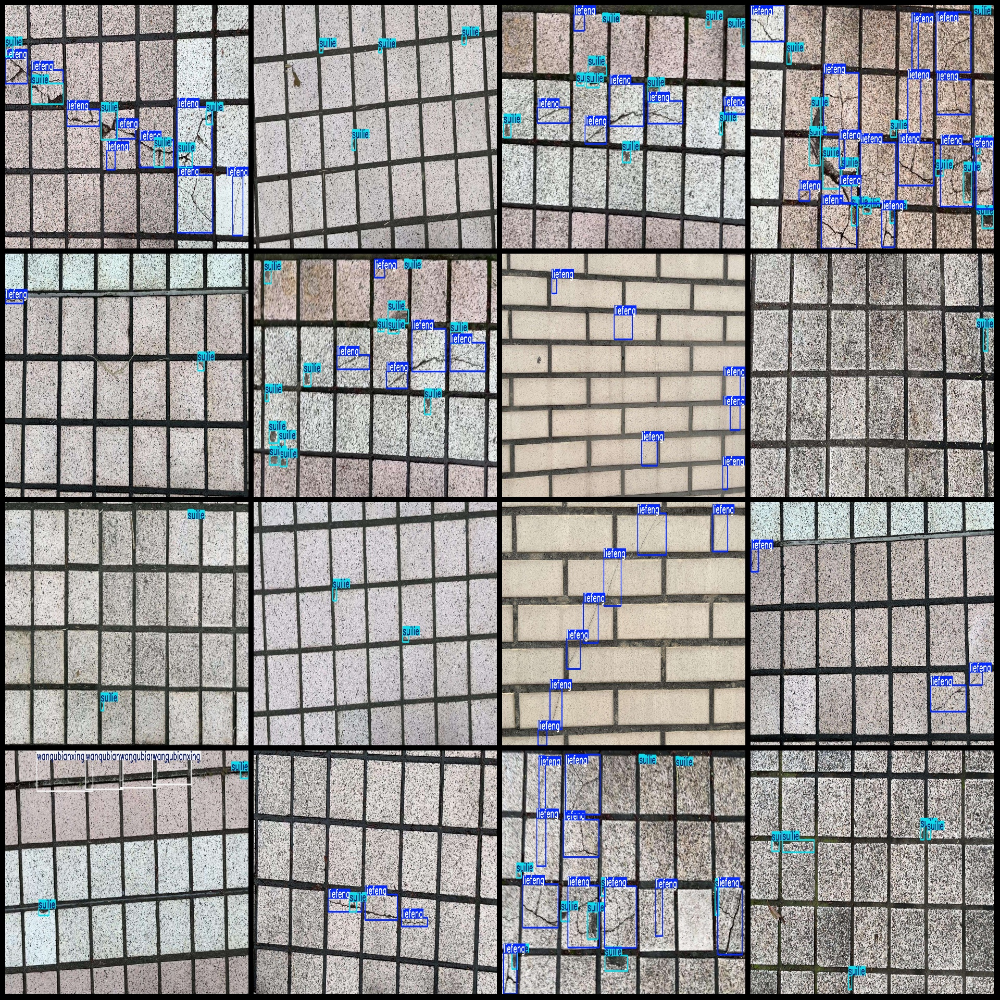
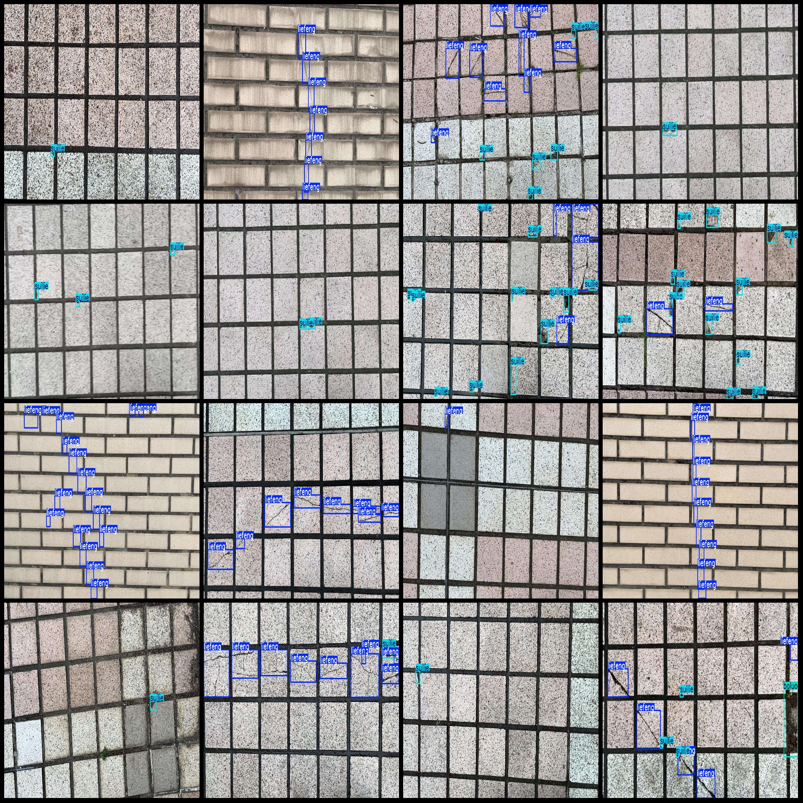

# Ground Floor Wall Tile Defect Detection Dataset VOC+YOLO Format with 2143 Images in 4 Categories

Dataset format: Pascal VOC format + YOLO format (txt file without split paths, only containing jpg images and corresponding VOC format xml files and yolo format txt files).
Number of images (jpg file count): 2143
Number of annotations (xml file count): 2143
Number of annotations (txt file count): 2143
Number of annotation categories: 4
Annotation category names (note that the order of categories in the yolo format is not consistent with this, but is based on the labels folder classes.txt): ["boluo", "liefeng", "suilie", 
"wanqubianxing"]
Number of bounding boxes for each category:
- Boluo (peeling) = 205
- Liefeng (cracks) = 7309
- Suilie (fractures) = 7728
- Wanqubianxing (bending deformation) = 227
Total bounding box count: 15469
Number of images per category:
- Boluo occupied images = 142
- Liefeng occupied images = 1438
- Suilie occupied images = 1723
- Wanqubianxing occupied images = 86
Image resolution: 1920x1080
Annotation tool used: labelImg
Annotation rules: Draw a rectangle around the category
Important note: The dataset does not have separate training, validation, or test sets; they must be manually divided.
Special declaration: This dataset does not guarantee the accuracy of the trained models or weight files.
Image preview:
Annotation example:

## Images

Here is a pay link on Stripe ( https://buy.stripe.com/3cs8yP7sY87d0vu9AB ). Please contact me lonlonago@foxmail.com after funding $89, and I will send you a complete data files , thank you!

